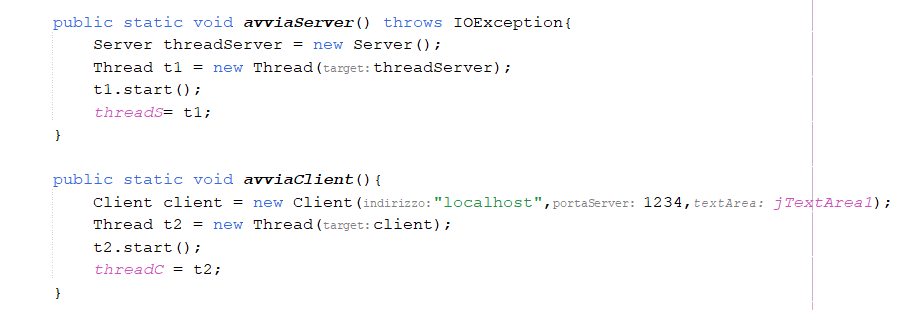

## Indice

- [Caso di studio](#caso-di-studio)
- [Diagramma delle classi](#diagramma-delle-classi)
- [Specifica algebrica](#specifica-algebrica)
- [Argomenti inseriti nel caso di studio](#argomenti-inseriti-nel-caso-di-studio)
  - [Paradigma OO](#paradigma-OO)
    - [Incapsulamento](#incapsulamento)
    - [Ereditarietà](#ereditarieta)
    - [Polimorfismo](#polimorfismo)
  - [Collection](#collection)
  - [Eccezioni](#eccezioni)
  - [File](#file)
  - [JDBC](#jdbc)
  - [Thread](#thread)
  - [Socket](#socket)
  - [Lambda expressions](#lambda-expressions)
  - [Swing](#swing)

---

## Caso di studio

---

## Diagramma delle classi
---

## Specifica algebrica

---

## Argomenti inseriti nel caso di studio

### Paradigma OO
Nel seguente caso di studio è stato fatto uso del paradigma OO(Object Oriented).
In questo paradigma si orgnanizza il codice intorno agli oggetti, i quali rappresentano entità del mondo reale o concetti astratti.
Ci sono tre principi fondamentali della programmazione orientata agli oggetti: Incapsulamento, Ereditarietà e Polimorfismo.
#### Incapsulamento
Information hiding e incapsulamento sono concetti cardine del paradigma orientato a oggetti.
Gli oggetti all'interno del programma incapsulano uno stato e un comportamento. Lo stato è identificato dal contenuto di una certa area di memoria. Il comportamento è definito come una collezione di procedure e funzioni (metodi) che possono operare sulla rappresentazione dell’area di memoria associata all’oggetto.
L'utilizzo dell'occultamento dell'informazione e l'incapsulamento rendono possibile l'uso di oggetti ricorrendo solo a metodi pubblici. Gli attributi delle classi sono quasi sempre privati, perciò non accessibili direttamente da altre classi o oggetti, essi forniscono un controllo più stretto sull'accesso e la modifica dei dati di una classe.

#### Ereditarietà
E' stato fatto utilizzo dell'ereditarietà, nonchè una relazione fondamentale tra le classi. Una classe è considerata come un repertorio di conoscenze a partire dal quale è possibile definire altre classi più specifiche, che completano le conoscenze della loro classe madre.
Un esempio di ereditarietà presente all'interno del caso di studio è la relazione tra la classe astratta Database e la classe DatabaseController, dove DatabaseController è una sottoclasse di Database, perciò eredita tutti i metodi e attributi public/protected. 
La sottoclasse DatabaseController introduce delle caratteristiche non presenti nella superclasse, quindi in questo caso è stata utilizzata l'ereditarietà per estensione.
Allo stesso tempo però la sottoclasse DatabaseController effettua l'overriding dei metodi ereditati dalla superclasse Database, fornendo un implementazione dei metodi astratti. Perciò in questo caso è stata utilizzata l'ereditarietà per variazione funzionale poichè si ridefiniscono alcune caratteristiche della superclasse.
Ovviamente questo non è l'unico utilizzo di ereditarietà all'interno del caso di studio.

#### Polimorfismo
E' stato fatto utilizzo del polimorfismo. Con questo termine si intende la possibilità di associare a una operazione diverse realizzazioni. 
Per esempio si è fatto uso del polimorfismo ad hoc, ottenuto quando un metodo lavora su tipi differenti e potrebbe comportarsi in maniera totalmente differente per ciascuno di essi. Un esempio di utilizzo lampante di polimorfismo per overloading (che rientra nel polimorfismo ad hoc) nel caso di studio è osservabile nell'implementazione del metodo getPunteggio della classe DatabaseController dove il metodo restituisce il punteggio di una partita sia passando il nome della partita (parametro di tipo String), sia passando l'id della partita (parametro di tipo int). La classe DatabaseController ha due diverse implementazioni del metodo getPunteggio in base al tipo del parametro ricevuto.
Inoltre, si è fatto utilizzo del polimorfismo universale, la cui idea è quella di operare su un numero infinito di tipi. Infatti nel caso di studio è stata creata una classe generica StampaListe che opera su un tipo generico T, permette di stampare attraverso il metodo 'stampa' la lista ricevuta in input dal costruttore indipendentemente dal tipo degli elementi della lista.

---
### Collection
All'interno del caso di studio sono state utilizzate le seguenti collection:
#### List
Le liste vengono utilizzate all'interno del caso di studio nelle seguenti situazioni:
* La classe Classifica ha come attributo una lista di elmenti di tipo Partita, la lista di partite viene utilizzata dal metodo 'ottieniClassificaUtenti' per filtrare le partite degli utenti e costruire il ranking degli utenti che hanno vinto almeno una partita con il punteggio massimo.
* Il metodo ottieniClassificaUtenti restitutuisce una lista di elementi di tipo Map.Entry<String,Integer>, nonchè una lista di coppie <chiave,valore> dove la chiave è il nome dell'utente e il valore il punteggio massimo associato a quell'utente.
* La classe DatabaseController ha un metodo 'ottieniListaPartite' che salva tutte le partite salvate su DB all'interno di una lista, per poi successivamente restituirla.
* La classe GameDescription ha come attributi:
  - una lista di elementi di tipo Stanza
  - una lista di elementi di tipo Comando
  - una lista di elementi di tipo Oggetto per l'inventario
  - una lista di elementi di tipo Oggetto per gli oggetti del gioco
* La classe Inventario ha come attributo una lista di elementi di tipo Oggetto utilizzata dai metodi della classe per aggiungere e rimuovere elementi nell'inventario
* La classe Stanza ha come attributo una lista di elementi di tipo Oggetto
* La classe OggettoContenitore ha come attributo una lista di elementi di tipo Oggetto contenente gli oggetti contenuti dal contenitore
* Il metodo parseString della classe Utils utilizza una lista di token, nonchè una lista di elementi di tipo String
* la classe generica 'StampaListe' utilizza come attributo una lista di elementi di tipo generico.
* Il metodo getPartite della classe FileMatchController restituisce una lista di elementi di tipo GiocoNaufragioIsola, nonchè una lista di partite salvate su file.
#### Set
* Set 'stopwords' utilizzato per contenere tutte le stopwords recuperate dal file senza contenere duplicati 
* La classe ControlGioco utilizza un set 'comandi', nonchè un set di elementi di tipo Comando
* La classe Oggetto utilizza un set 'aliasOggetto' per contenere tutti i possibili alias del nome di un oggetto e un set 'comandiConsentiti' per contenere tutti i comandi consentiti su un determinato oggetto
* La classe Comando utilizza un set 'aliasComando' per contenere tutti gli alias del nome di un comando
#### Map
* Il metodo ottieniClassificaUtenti della classe Classifica salva in una Map con chiave di tipo String e valore di tipo Integer tutti gli utenti che hanno vinto almeno una partita con il loro corrispettivo punteggio massimo, la chiave è il nome dell'utente, il valore il punteggio massimo.
* Lista di elementi di tipo Map.Entry<String,Integer> per contenere le coppie chiave-valore(nome utente-punteggio massimo) per la stampa del ranking.

---
### Eccezioni
Sono state utilizzate molto frequentemente le eccezioni. Molti metodi nel programma possono generare eccezioni, ognuna di esse è catturata e gestita utilizzando l'appropriata tipologia di eccezione.

---
### File
Il programma offre la possibilità di salvare una partita una volta che essa è terminata. Il salvataggio delle partite avviene anche su file.
Per la gestione dei file sono state usate le classi FileController, FileMatchController e l'interfaccia FileInterface.

- La classe FileController implementa l'interfaccia FileInterface, la quale contiene il solo metodo create(). 
La classe FileController si occupa di creare un nuovo file (se non è già esistente) e ha i seguenti attributi protected: nomeFile, directory, file e percorso. 
directory rappresenta la cartella in cui verrà memorizzato il file all'interno del progetto, nomeFile come intuibile dal nome è il nome del file che verrà creato.
Il percorso del file viene costruito dinamicamente da un metodo della classe Utils che riceve in input gli attributi nomeFile e directory.

- La classe FileMatchController estende la classe FileController ereditanto gli attributi/metodi public/protected e aggiungendo nuove funzionalità (metodi), nonchè l'aggiunta di una nuova partita all'interno del file, il recupero di una specifica partita salvata su file utilizzando il nome della partita (utile per il caricamento di una partita salvata), il recupero di tutte le partite salvate su file (utile per la costruzione dinamica della JComboBox dalla quale l'utente può scegliere quale partita continuare/caricare).

---
### JDBC
Il salvataggio di una partita non avviene solamente su file, bensì avviene anche su database. E' stato utilizzato il database Engine H2 poichè può essere utilizzato in modo embedded senza necessità di installare un server.

Per la gestione dei DB utilizziamo una classe astratta Database che memorizza le query utili alle funzionalità del programma nei relativi attributi protected (attributi che vengono ereditati dalle sottoclassi di Database). L'unico metodo implementato dalla classe astratta Database è quello relativo alla connessione al DB, tutti i restanti metodi sono astratti. 

La classe DatabaseController estende la classe astratta Database e utilizzando gli attributi ereditati contenenti le stringhe delle query implementa i metodi astratti della superclasse e aggiunge nuovi metodi.
Si occupa delle seguenti funzionalità:
* chiudere la connessione al DB
* creare la tabella della partita (solamente se non è già esistente)
* salvare una nuova partita nel DB
* recuperare dal DB il punteggio di una specifica partita utilizzando l'id della partita
* recuperare dal DB il punteggio di una specifica partita utilizzando il nome della partita
* stampare tutte le partite salvate su DB
* recuperare tutte le partite salvate su DB
* recuperare tutte le partite salvate su DB di uno specifico utente
* recuperare il punteggio medio di tutte le partite su DB
* recuperare il punteggio medio di tutte le partite di uno specifico utente su DB
* recuperare il punteggio medio delle partite terminate
* verificare l'esistenza di una partita nel DB utilizzando il nome della partita
* restituire tutte le partite salvate su DB come lista di elementi di tipo Partita

Le seguenti funzionalità sono state utilizzate per permettere all'utente di visualizzare statistiche in forma tabellare. E' possibile visualizzare sia statistiche generali che statistiche specifiche all'utente in gioco.

---
### Thread
L'utilizzo dei thread all'interno del progetto è fondamentale per la visualizzazione del timer in tempo reale, il quale viene visualizzato nel frame principale dell'app durante la partita.

Per la creazione di un thread in grado di gestire e visualizzare il timer della partita abbiamo creato una classe ThreadTempo (che tiene traccia delle ore, minuti e secondi passati durante la partita), la quale implementa l'interfaccia Runnable. Ogni volta che viene avviata una nuova partita viene avviato il thread per il tempo, il quale incrementa il numero di secondi, minuti e ore in tempo reale, aggiorna costantemente gli attributi relativi al tempo della classe GameDescription per tenere traccia del tempo passato all'interno della partita. 

Quando la partita termina oppure quando l'utente vince la partita il thread per il tempo viene interrotto attraverso la chiamata del metodo interrupt(), perciò il tempo della partita si ferma e non verrà più aggiornato.

L'app permette anche il caricamento di una partita salvata, la classe ThreadTempo gestisce anche questo caso, riprendendo il timer dal tempo di partita del suo salvataggio e continuando normalmente l'esecuzione del timer. Ogni secondo il thread aggiorna il frame dinamicamente stampando nell'interfaccia utente il numero di ore, minuti e secondi trascorsi durante la partita.

Altrettanto fondamentale è l'utilizzo dei thread per la musica e i suoni presenti all'interno del gioco. La classe Suono tra gli attributi ha un oggetto della classe Thread che viene avviato ogni qual volta viene chiamato il metodo riproduciTraccia. Ogni stanza della mappa del gioco ha una musica di sottofondo differente e ad ogni spostamento nella mappa viene chiamato il metodo riproduciTraccia che avvia il thread che si occupa di eseguire il corretto suono di sottofondo per la stanza corrente. Sono previste musiche differenti anche in altre situazioni come per esempio i suoni di digitazione del codice per l'accesso all'edificio abbandonato. Oppure la musica in caso di vittoria.  Oppure ancora nel dialogo via radio tra l'utente e i militari.

I suoni delle diverse stanze non si vanno mai a sovrapporre poichè ogni volta che ci si sposta nella mappa viene ucciso il thread per la musica della stanza precedente e viene avviato un nuovo thread per la musica della stanza corrente. Quando l'utente abbandona la partita viene interrotto il thread della classe Suono.

Inoltre, i thread vengono utilizzati per la comunicazione Client-Server con i socket. Approfondiamo il loro utilizzo nel prossimo paragrafo relativo ai Socket.

---
### Socket
Quando l'utente accende la radio, l'applicazione apre una finestra per il dialogo via radio tra il giocatore disorientato nell'isola e i militari.
Per la comunicazione tra l'utente e i militari abbiamo utilizzato una comunicazione Client-Server utilizzando i Socket.

Al momento della generazione della finestra per il dialogo vengono avviati sia il client che il server

come possiamo notare sia la classe Client che la classe Server implementano l'interfaccia Runnable poichè i due oggetti vengono passati al costruttore Thread per avviare due thread che si occupano di eseguire rispettivamente le funzionalità del server e del client.
All'avvio dei due thread, il server rimane in attesa di una connessione su una porta, nel frattempo il client si connette al server pronto per lo scambio dei messaggi.

#### Client:

Il client rappresenta l'utente nella conversazione via radio.
Il metodo leggiRispostaServer legge il messaggio inviato dal server e lo scrive nella TextArea dell'interfaccia per rendere visibile al client (l'utente) la risposta del server. 

#### Server:

Il server rappresenta i militari nella conversazione via radio. 
Il metodo elaboraMessaggio legge il messaggio inviato dal client e in base al messaggio ricevuto restituisce la risposta idonea al proseguio della conversazione.

Il dialogo via radio offre all'utente un importante indizio per la risoluzione del gioco.

#### Comunicazione client-server:

Ogni volta che il client conferma un opzione invia un messaggio al server. Il server legge la risposta del client, elabora il messaggio e restituisce una risposta al client. La risposta del server viene visualizzata in tempo reale nell'interfaccia utente dando vita a un vero e proprio dialogo dinamico tra i due attori dove la risposta del server dipende dal messaggio inviato del client.
La risposta del server non è solo testuale, infatti restituisce anche una risposta audio dei militari con interferenze radio per rendere il gioco il più realistico possibile.

Il messaggio inviato dal client è l'opzione selezionata.
Nel momento in cui l'utente seleziona la risposta viene invocato il metodo statico inviaMessaggio della classe Client, e vengono settate le nuove opzioni nell'interfaccia per permettere all'utente (client) di inviare nuovi messaggi ai militari (server).

Quando l'utente spegne la radio oppure chiude la finestra vengono chiusi il server socket e il socket client per liberare le risorse, ma soprattutto vengono interrotti i due thread che eseguivano il Client e il Server.

---
### Lambda expressions
Abbiamo creato due interfacce funzionali: SalvaPartita e EsistenzaPartita.
Queste ultime sono delle interfacce funzionali poichè hanno un solo metodo astratto.

- Il metodo esegui dell'interfaccia funzionale SalvaPartita prende in input un oggetto GameDescription  e salva una partita su Database.
Utilizziamo l'interfaccia funzionale per salvare la partita su DB:

- Il metodo test dell'interfaccia funzionale EsistenzaPartita prende in input il nome di una partita e restituisce true se le la partita esiste nel database.

Utilizziamo l'espressione lambda per dare l'implementazione del metodo dell'interfaccia funzionale SalvaPartita, una volta data l'implementazione chiamiamo il metodo esegui dell'interfaccia funzionale che si comporterà come definito dalla lambda expression.

---
### Swing

---

